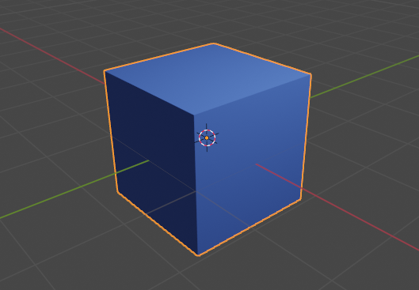
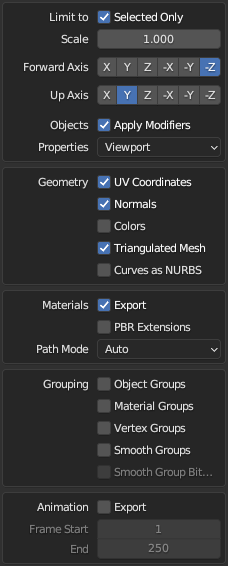
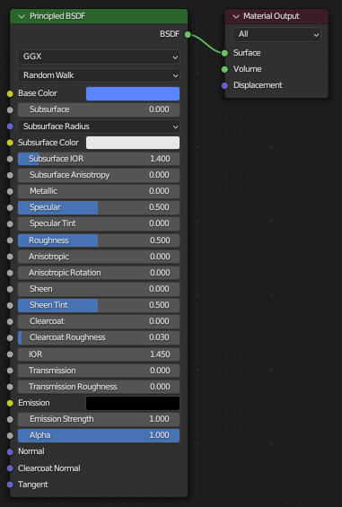

# Create 3D Models with Blender

Geometry can be created and exported with `Blender`, in `.obj` format with limited Material (`.mtl`) support.

Tested with **Blender v3.4.1**.

Here is a basic workflow, some `Blender` knowledge is required.

Select all desired meshes and export them with the `Wavefront (.obj)` exporter using the recommended settings below.

-   Limit to: Selected Only
-   Forward Axis: `-Z` (maps Blender's Forward axis **Y** to the typical GL Forward **-Z**)
-   Up Axis: `Y` (maps Blender's Up axis **Z** to the typical GL Up **Y**)
-   Objects: Apply Modifiers
-   Geometry: Export `UV Coordinates`, `Normals` and make the Mesh `Triangulated`
-   Materials: Export

The generic `Principled BSDF` shader has an impact on the exported materials in the `.mtl` file. If you want to use it, apply this shader to your meshes.

-   Principled BSDF `Base Color` is exported as `Kd` (diffuse color) into the materials (`.mtl`) 
    -   The `Base Color` in the example shader below causes this `Kd` entry in the exported material: `Kd 0.102684 0.235477 1.000000`

See [Object (.obj) and Material (.mtl) support](#object-obj-and-material-mtl-support) on how this information can be used in `yourgame`.

