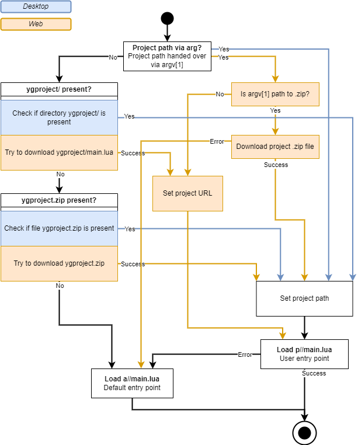

# Entry Point

## Search Logic

On start-up, the application searches for the entry point script `main.lua` in these locations, descenting:

-   in a directory or `.zip` file, the command line argument `argv[1]` is pointing to
-   in the directory `ygproject/`, next to the executable
-   in the `.zip` file `ygproject.zip`, next to the executable
-   in `assets/` directory, next to the executable

## Technical View

