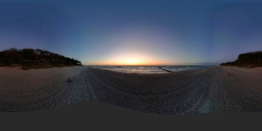
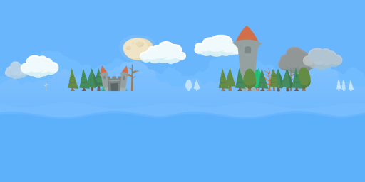

# Sky

## Draw
To draw sky in the scene, an image with **equirectangular projection** (aspect ratio 2:1) is used. These are images that typically 360-degree cameras generate.

Use [yg.gl.drawSky()](yg_gl.md#function-yggldrawsky) or [yg.gl.drawSky2()](yg_gl.md#function-yggldrawsky2) to draw sky. Sky should usually be the first thing to draw in a scene to prevent occlusion.

## Sky Images

Here are some examples of images, that can be used as sky in `yourgame`.

### Gradient with Horizon

### 360-degree Photo

### Assembled from Sprites

The image above has been created with this tool:

<iframe frameborder="0" src="https://itch.io/embed/1120244?bg_color=465360&amp;fg_color=ffffff&amp;link_color=d6e5f5&amp;border_color=515c68" width="552" height="167"><a href="https://didaduddel.itch.io/skytool">Skybox Composing Tool by didaduddel</a></iframe>
